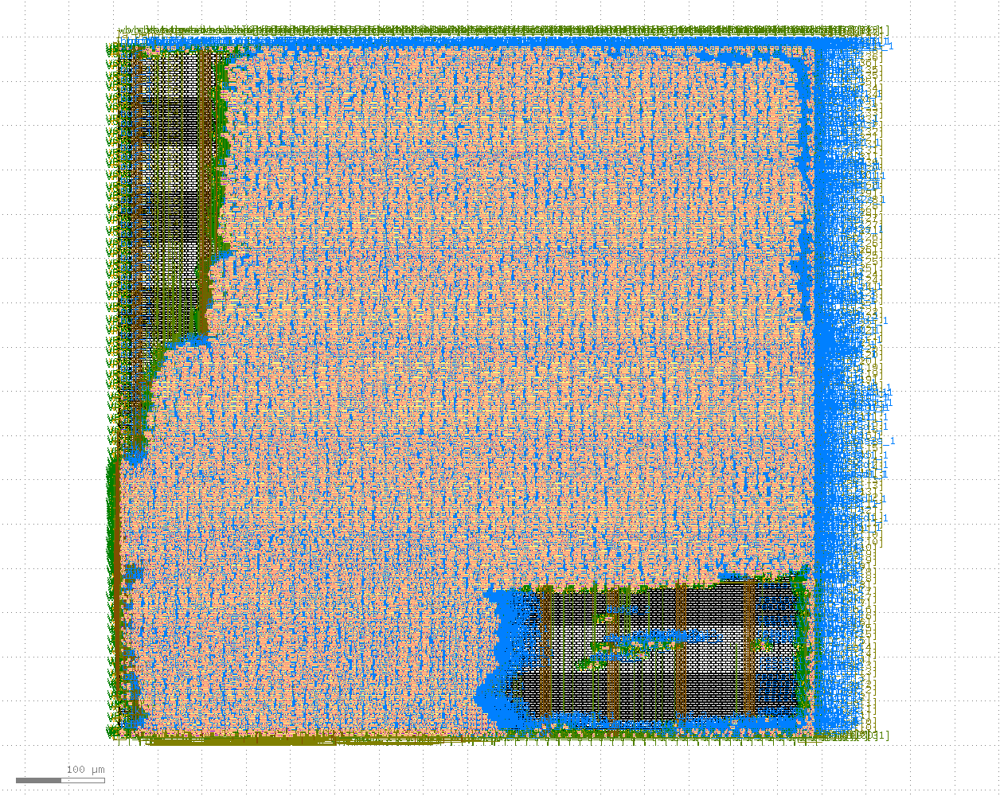

# Caravel User Project

[](https://opensource.org/licenses/Apache-2.0) [](https://github.com/efabless/caravel_project_example/actions/workflows/user_project_ci.yml) [](https://github.com/efabless/caravel_project_example/actions/workflows/caravel_build.yml)


# SHA-1 engine

See a [https://github.com/konradwilk/sha1](https://github.com/konradwilk/sha1) for the full git history of this code. Branch name is submission-mpw-two.

This is an implementation of [https://www.rfc-editor.org/rfc/inline-errata/rfc3174.html](RFC 3174) of SHA-1 engine.

It is not the most secure one nowadays (it is still used for git commit ids and TPM PCR values), but
it looked like the easiest of the SHA engines to implement. The communication channel is via
WishBone commands to provide sixteen words after which the engine starts and computes the digest
in about 160 cycles. Then digest can be retrieved via the wishbone. There is a IRQ line so when
it has completed it will bring it high if that is enabled.



If you want to see this more interactively, I would recommend you clone
[https://github.com/konradwilk/sha1](https://github.com/konradwilk/sha1) and run

```
make test_wb_logic
```

which will use the various WishBone commands to program it.

